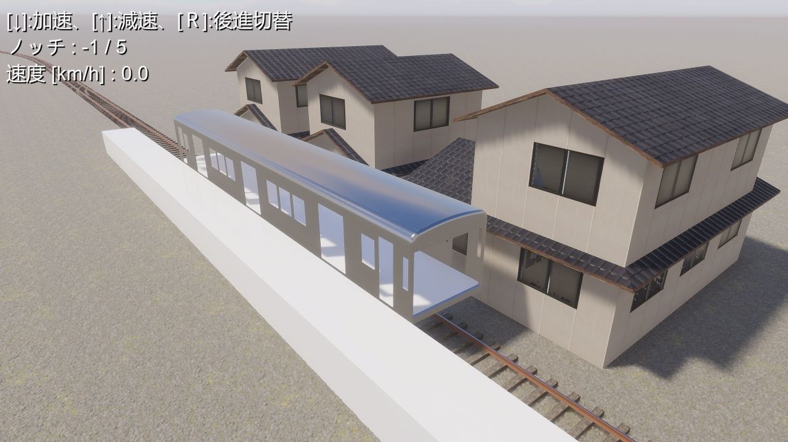

# UnityRailways
## 概要
Unityの物理演算機能を使って鉄道車両を走らせてみようぜというプロジェクトです。

## 謝辞
このプロジェクトは、以下のCC0でライセンスされた著作物を利用して作成しました。
- 鉄道関連で使用
  - 「Gravel 011」 (https://ambientcg.com/view?id=Gravel011)
  - 「Metal 051 C」 (https://ambientcg.com/view?id=Metal051C)
  - 「Rough Wood」 (https://polyhaven.com/a/rough_wood)
  - 「Rust Coarse 01」 (https://polyhaven.com/a/rust_coarse_01)
- 家屋に使用
  - 「Roofing Tiles 013 A」 (https://ambientcg.com/view?id=RoofingTiles013A)
  -  「Worn Planks」 (https://polyhaven.com/a/worn_planks)
  - 「Plastered Wall 02」 (https://polyhaven.com/a/plastered_wall_02)
  - 「Facade 018 A」 (https://ambientcg.com/view?id=Facade018A) ※窓部分のみ
  - 「Facade 018 C」 (https://ambientcg.com/view?id=Facade018C) ※窓部分の発光テクスチャのみ
- エフェクトに使用
  - 「Explosion02HD」 (https://unity.com/blog/engine-platform/free-vfx-image-sequences-flipbooks)
